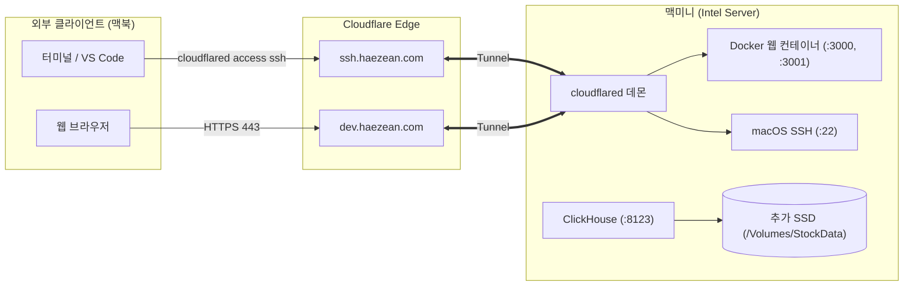

# Intel 맥미니 개발용 홈 서버 구축 가이드
> 대상 환경: Mac mini 2018 (Intel Core i5, x86_64, macOS Sequoia)  
> 사용자 계정: `kyuseok`  
> 내부 유선 IP: `192.168.0.33`  
> 스토리지: 내장 SSD 256GB (macOS 시스템/앱) + 추가 SSD 250GB (주식 시계열 DB 전용)

---

## 1. 서버 필수 전원 및 무인 운영 설정

화면이 꺼지거나 정전 후 복구되었을 때 서버가 멈추지 않고 항상 켜져 있도록 설정합니다.

### 1) 절전 방지 및 자동 시작 (맥미니 터미널)
```bash
# 잠자기 비활성화, 디스플레이 꺼짐 10분, 정전 후 자동 켜짐, 네트워크 깨우기 활성화
sudo pmset -a sleep 0 displaysleep 10 autorestart 1 womp 1
```

### 2) 사용자 자동 로그인 활성화 (중요)
macOS는 사용자 로그인 세션이 열려야 Docker/OrbStack 백그라운드 엔진이 정상 기동합니다.
* **시스템 설정 > 사용자 및 그룹 > 자동 로그인**을 `kyuseok` 계정으로 활성화합니다.
* *(참고: FileVault가 켜져 있으면 자동 로그인이 비활성화되므로, 필요시 시스템 설정 > 개인정보 보호 및 보안 > FileVault를 끔)*

---

## 2. 추가 SSD(250GB) 초기화 및 ClickHouse 전용 스토리지 분리

기존 윈도우(NTFS)가 설치되어 있던 추가 SSD를 macOS 전용 파일시스템(APFS)으로 포맷하고, 용량이 커지는 주식 시계열 데이터(ClickHouse)를 이 드라이브에 격리 저장합니다.

### 1) 주식 데이터 용량 산정 및 분리 필요성
* **일봉(daily_prices)**: 2,600종목 × 250영업일 = 연간 약 65만 행. ClickHouse LZ4 압축 시 **연간 15~20MB**, 10년 치를 모아도 200MB 이하로 매우 가볍습니다.
* **분봉(1분봉)**: 2,600종목 × 390분 = 하루 약 100만 행. 연간 약 2.5억 행 누적.
  * ClickHouse 컬럼 압축 및 보조지표 포함 시 **연간 약 8~12GB** 발생.
  * 3~5년 치 누적 시 **40~60GB** 이상 차지.
* **ClickHouse MergeTree 백그라운드 병합(Merge)**:
  * ClickHouse는 데이터를 압축·병합할 때 파트 크기의 최대 2배까지 **임시 디스크 공간**을 필요로 합니다.
  * 시스템 드라이브(내장 256GB)에 이를 두면 OS 디스크 풀(Disk Full)로 macOS 자체가 멈출 위험이 있습니다.
* **결론**: 추가 250GB SSD를 `StockData` 볼륨으로 지정하여 ClickHouse, PostgreSQL, 백업 파일을 전용 분리 운영합니다.

### 2) 추가 SSD 초기화 (Windows NTFS → APFS 포맷)
맥미니 터미널에서 실행:

```bash
# 1. 디스크 목록 확인 (추가 SSD의 식별자 확인: 예 /dev/disk2 또는 /dev/disk3)
diskutil list

# 윈도우 파티션(Microsoft Basic Data / NTFS)이 있는 디스크 번호를 정확히 확인합니다.
# ⚠️ 주의: 반드시 추가 장착한 250GB 디스크 번호를 지정해야 합니다! (내장 디스크 disk0 포맷 금지)

# 2. 추가 SSD 전체 초기화 및 APFS 포맷 (이름: StockData)
# 예시: 대상 디스크가 /dev/disk2 일 때:
diskutil eraseDisk APFS StockData /dev/disk2
```

### 3) 스토리지 디렉토리 생성 및 권한 설정
포맷 완료 시 macOS에서 자동으로 `/Volumes/StockData` 경로로 마운트됩니다.
```bash
# DB 및 백업용 디렉토리 생성
sudo mkdir -p /Volumes/StockData/clickhouse
sudo mkdir -p /Volumes/StockData/postgres
sudo mkdir -p /Volumes/StockData/redis
sudo mkdir -p /Volumes/StockData/backups

# 사용자 권한 부여 (Docker/OrbStack 컨테이너 접근 보장)
sudo chown -R kyuseok:staff /Volumes/StockData
sudo chmod -R 777 /Volumes/StockData/clickhouse /Volumes/StockData/postgres /Volumes/StockData/redis
```

### 4) Docker Compose에 스토리지 경로 주입 (`compose.env`)
배포 시 호스트 시크릿 디렉토리(`/opt/stock_app/env/compose.env`)에 아래 설정을 등록하면, Docker Compose가 자동으로 내장 볼륨 대신 추가 SSD 경로를 바인드 마운트합니다:

```ini
# /opt/stock_app/env/compose.env
CLICKHOUSE_DATA_DIR=/Volumes/StockData/clickhouse
POSTGRES_DATA_DIR=/Volumes/StockData/postgres
REDIS_DATA_DIR=/Volumes/StockData/redis
```

---

## 3. SSH 활성화 및 로컬 접속 설정

### 1) SSH 서버 활성화
* **시스템 설정 > 일반 > 공유 > '원격 로그인(Remote Login)'** 스위치를 **켬(ON)**으로 변경합니다.
* 옆의 **(i)** 정보 버튼에서 `kyuseok` 계정에 접근 권한이 부여되었는지 확인합니다.

### 2) SSH 키 디렉토리 생성 (맥미니 터미널)
```bash
mkdir -p ~/.ssh && chmod 700 ~/.ssh
touch ~/.ssh/authorized_keys && chmod 600 ~/.ssh/authorized_keys
```

### 3) 로컬 네트워크 접속 테스트 (맥북 터미널)
```bash
# 1. 비밀번호로 접속 확인
ssh kyuseok@192.168.0.33

# 2. 비밀번호 없이 접속하기 위한 SSH 키 복사
ssh-copy-id kyuseok@192.168.0.33
```

---

## 4. Docker 환경 구축 (Intel Mac)

### 1) OrbStack (Intel Mac 버전) 설치 권장
Docker Desktop에 비해 유휴 CPU/메모리 자원을 대폭 절약하는 OrbStack을 권장합니다.
1. [OrbStack 다운로드](https://orbstack.dev/download)에서 **Intel Mac (x86_64)** 버전 설치  
   *(터미널 명령: `curl -fsSL https://orbstack.dev/install | sh`)*
2. OrbStack 실행 후 로그인 시 자동 기동 설정 확인
3. 터미널 동작 확인:
   ```bash
   docker --version
   docker compose version
   ```

---

## 5. 저장소 클론 및 최초 컨테이너 기동

### 1) 호스트 시크릿 파일 구성 (맥미니 터미널)
```bash
sudo mkdir -p /opt/stock_app/env
sudo chown -R kyuseok:staff /opt/stock_app/env
chmod 700 /opt/stock_app/env

# 1. 앱 환경변수 작성
nano /opt/stock_app/env/.env.production
# (backend/.env.example 내용 참조: DATABASE_URL, CLICKHOUSE_HOST, KIS 키 등)

# 2. 스토리지 분리용 compose.env 작성
cat << 'EOF' > /opt/stock_app/env/compose.env
CLICKHOUSE_DATA_DIR=/Volumes/StockData/clickhouse
POSTGRES_DATA_DIR=/Volumes/StockData/postgres
REDIS_DATA_DIR=/Volumes/StockData/redis
EOF
```

### 2) 프로젝트 클론 및 초기화
```bash
git clone https://github.com/kyuseokyi/stock_app.git ~/stock_app
cd ~/stock_app

cp /opt/stock_app/env/.env.production backend/.env.production
cp /opt/stock_app/env/compose.env .env

# 전체 서비스 백그라운드 빌드 및 기동
docker compose -f docker-compose.prod.yml up -d --build

# DB 스키마 생성 및 초기 시드
docker compose -f docker-compose.prod.yml run --rm stock_api uv run alembic upgrade head
docker compose -f docker-compose.prod.yml run --rm stock_api uv run python -m shared.clickhouse_schema
docker compose -f docker-compose.prod.yml run --rm auth_api uv run python -m apps.auth.seed_admin
```

---

## 6. GitHub Actions Self-hosted Runner 등록 (CI/CD 자동 배포)

맥북에서 `git push origin main` 시 맥미니가 스스로 코드를 받아 재배포하도록 등록합니다.

1. GitHub 저장소 **Settings > Actions > Runners > New self-hosted runner** (macOS / x64 선택)
2. 맥미니 터미널:
   ```bash
   mkdir -p ~/actions-runner && cd ~/actions-runner
   curl -o actions-runner-osx-x64-2.322.0.tar.gz -L https://github.com/actions/runner/releases/download/v2.322.0/actions-runner-osx-x64-2.322.0.tar.gz
   tar xzf ./actions-runner-osx-x64-2.322.0.tar.gz

   # 토큰 등록
   ./config.sh --url https://github.com/kyuseokyi/stock_app --token <GITHUB_TOKEN>

   # macOS 서비스 등록 (도커 CLI PATH 등록 포함)
   echo "$PATH" > ~/actions-runner/.path
   ./svc.sh install
   ./svc.sh start
   ```

---

## 7. Cloudflare Tunnel (외부 웹 + 원격 SSH 접속)

공유기 포트포워딩 없이 외부에서 안전하게 맥미니 서버 및 웹 서비스에 접속합니다.



### 1) 맥미니에 cloudflared 데몬 설치 및 서비스 등록
```bash
# Intel Mac용 cloudflared 바이너리 다운로드 및 압축 해제 (이미 설치 완료됨)
curl -sL https://github.com/cloudflare/cloudflared/releases/latest/download/cloudflared-darwin-amd64.tgz | tar -xz -C ~/.orbstack/bin/
cloudflared --version

# 시스템 데몬으로 서비스 등록 (부팅 시 자동 실행)
sudo ~/.orbstack/bin/cloudflared service install <Cloudflare에서_발급받은_터널_토큰>
```

---

## 8. 외부 노트북(맥북) 접속 설정

### 1) 맥북에 cloudflared 설치
```bash
brew install cloudflared
```

### 2) 맥북 `~/.ssh/config` 설정
```ssh-config
# 집 내부 Wi-Fi 접속용
Host macmini-local
    HostName 192.168.0.33
    User kyuseok
    ServerAliveInterval 60

# 외부(카페, 원격지) Cloudflare Tunnel 접속용
Host macmini-remote
    HostName ssh.haezean.com
    User kyuseok
    ProxyCommand cloudflared access ssh --hostname %h
    ServerAliveInterval 60
```

### 3) 접속 및 VS Code 연동
* **터미널**: `ssh macmini-local` (집 내부) 또는 `ssh macmini-remote` (외부)
* **VS Code**: `Remote - SSH: Connect to Host...` > `macmini-local` 선택 시 맥북에서 맥미니 소스코드를 직접 개발 가능
