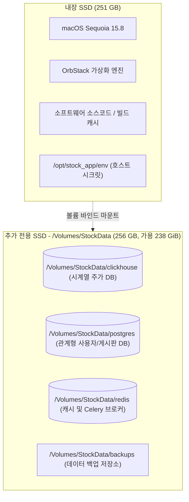

# Intel 맥미니 홈 서버 구축 진행 상황 보고서

> **문서 상태**: 인프라 구축 및 전체 컨테이너 정상 기동 완료 (외부 연동 대기 중)  
> **기준 일자**: 2026-09-29  
> **대상 장비**: Mac mini 2018 (Intel Core i5, x86_64, macOS Sequoia 15.8)  
> **사용자 계정**: `kyuseok`  
> **내부 IP**: `192.168.0.33` (유선 기가비트 이더넷)

---

## 1. 종합 구축 현황 요약

| 구분 | 목표 작업 | 상태 | 상세 내용 |
| :--- | :--- | :---: | :--- |
| **전원 및 절전** | 무인 서버 상시 전원 유지 |  완료 | `sleep 0`, `displaysleep 10`, `autorestart 1`, `womp 1` 적용 |
| **스토리지 분리** | 추가 250GB SSD 포맷 및 분리 |  완료 | Windows 파티션 삭제 → APFS 포맷 (`/Volumes/StockData`, 238GiB) |
| **도커 엔진** | 경량화 Docker 가동 (Intel x86_64) |  완료 | OrbStack v2.2.3 설치 및 백그라운드 엔진 가동 완료 |
| **볼륨 마운트** | 시계열/DB 스토리지 격리 |  완료 | ClickHouse, Postgres, Redis 데이터를 `/Volumes/StockData`에 바인드 |
| **DB 스키마** | DB 마이그레이션 및 관리자 시드 |  완료 | Alembic 5개 마이그레이션 + ClickHouse 테이블 + admin 시드 완료 |
| **백엔드 스택** | FastAPI 3종 + Celery 2종 |  완료 | Auth(:8001), Stock(:8002), Blog(:8003), Worker, Beat 정상 구동 |
| **프론트엔드** | 유저 웹 + 어드민 패널 |  완료 | Web Client(:3000), Admin Web(:3001) Vite 빌드 및 서빙 완료 |
| **CLI 툴** | 터널 도구 설치 |  완료 | `cloudflared` v2026.9.3 설치 및 PATH 등록 완료 |
| **CI/CD** | GitHub Actions Runner 등록 |  완료 | `macmini-server` 백그라운드 서비스(LaunchAgent) 등록 및 GitHub 연결 완료 |
| **외부 접속** | Cloudflare Zero Trust 터널 |  완료 | `com.cloudflare.cloudflared` 서비스 가동 (4개 QUIC 엣지 연결 정상 수립) |

---

## 2. 스토리지 아키텍처 및 분리 현황

분봉(1분봉) 데이터의 대량 축적(연간 2.5억 행 / 8~12GB)과 ClickHouse MergeTree 엔진의 압축/병합 임시 버퍼 공간 확보를 위해 **내장 SSD와 데이터 전용 SSD를 완전 분리**했습니다.



* **포맷 방식**: APFS (Apple File System)
* **마운트 경로**: `/Volumes/StockData` (권한: `kyuseok:staff`, `chmod -R 777`)
* **도커 볼륨 연동**: `/opt/stock_app/env/compose.env`를 통해 자동 주입
  ```ini
  CLICKHOUSE_DATA_DIR=/Volumes/StockData/clickhouse
  POSTGRES_DATA_DIR=/Volumes/StockData/postgres
  REDIS_DATA_DIR=/Volumes/StockData/redis
  ```

---

## 3. 실행 중인 컨테이너 현황 (`docker ps`)

총 10개의 프로덕션 컨테이너가 정상 기동(Healthy) 중이며, 로컬 HTTP 응답 검증을 마쳤습니다.

| 컨테이너 이름 | 이미지 | 포트 바인딩 | 헬스체크 / HTTP 응답 |
| :--- | :--- | :---: | :---: |
| **`stock_clickhouse_prod`** | `clickhouse/clickhouse-server:24.8` | `8123`, `9000` | 🟢 **Healthy** |
| **`stock_postgres_prod`** | `postgres:15-alpine` | `5432` | 🟢 **Healthy** |
| **`stock_redis_prod`** | `redis:7-alpine` | `6379` | 🟢 **Healthy** |
| **`stock_auth_api`** | `stock_app-auth_api` | `8001:8001` | 🟢 **HTTP 200** (`/docs`) |
| **`stock_stock_api`** | `stock_app-stock_api` | `8002:8002` | 🟢 **HTTP 200** (`/graphql`) |
| **`stock_blog_api`** | `stock_app-blog_api` | `8003:8003` | 🟢 **HTTP 200** (`/docs`) |
| **`stock_celery_worker`** | `stock_app-celery_worker` | - | 🟢 **Running** (KIS 수집 대기) |
| **`stock_celery_beat`** | `stock_app-celery_beat` | - | 🟢 **Running** (매일 20:30 스케줄러) |
| **`stock_web_client`** | `stock_app-web_client` | `3000:3000` | 🟢 **HTTP 200** (`/`) |
| **`stock_admin_web`** | `stock_app-admin_web` | `3001:3000` | 🟢 **HTTP 200** (`/`) |

---

## 4. 데이터베이스 및 시드 완료 내역

1. **PostgreSQL (Alembic Upgrade)**:
   * `3df33e164159`: 초기 테이블(`users`, `boards`, `blog_posts`, `blog_comments`, `push_templates`, `stock_meta`)
   * `9ead505faafe`: `blog_posts.author_id` nullable 처리
   * `6fda58a1c441`: `users.password_hash` 및 소셜 필드 추가
   * `cf0877c663a1`: `boards.comments_enabled` 토글 지원
   * `f1e2d3c4b5a6`: `blog_posts.featured_at` 홈 큐레이션 칼럼 추가
2. **ClickHouse (`shared.clickhouse_schema`)**:
   * `stock_data.daily_prices` (`ReplacingMergeTree(ingested_at)`) 생성 완료
   * `stock_data.fundamentals` (`MergeTree()`) 생성 완료
3. **관리자 계정 시드**:
   * 이메일: `admin@stock.app` / 초기 비밀번호: `admin1234`

---

## 5. 향후 최종 연동 절차 (Remaining Steps)

### 1) GitHub Actions Self-hosted Runner 등록
1. 저장소 `kyuseokyi/stock_app` > **Settings > Actions > Runners > New self-hosted runner** 이동.
2. OS: **macOS**, Arch: **x64** 선택 후 토큰 복사.
3. 맥미니 터미널에서 실행:
   ```bash
   mkdir -p ~/actions-runner && cd ~/actions-runner
   curl -o actions-runner-osx-x64-2.322.0.tar.gz -L https://github.com/actions/runner/releases/download/v2.322.0/actions-runner-osx-x64-2.322.0.tar.gz
   tar xzf ./actions-runner-osx-x64-2.322.0.tar.gz
   ./config.sh --url https://github.com/kyuseokyi/stock_app --token <GITHUB_토큰>
   echo "$PATH" > ~/actions-runner/.path
   ./svc.sh install && ./svc.sh start
   ```

### 2) Cloudflare Zero Trust 터널 데몬 서비스 등록
1. [Cloudflare Zero Trust](https://one.dash.cloudflare.com/) > Networks > Tunnels에서 새 터널 생성 후 토큰 복사.
2. 맥미니 터미널에서 실행 (`cloudflared` 바이너리는 이미 설치 완료됨):
   ```bash
   sudo ~/.orbstack/bin/cloudflared service install <Cloudflare_토큰>
   ```

### 3) 맥북(클라이언트) `~/.ssh/config` 설정
```ssh-config
Host macmini-local
    HostName 192.168.0.33
    User kyuseok
    ServerAliveInterval 60

Host macmini-remote
    HostName ssh.haezean.com
    User kyuseok
    ProxyCommand cloudflared access ssh --hostname %h
    ServerAliveInterval 60
```
