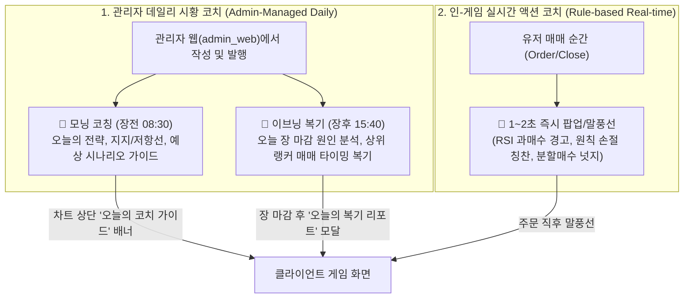
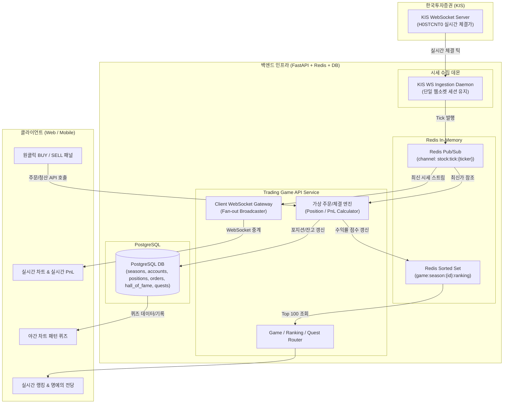

# 트레이딩 게임 (Trading Game) 아키텍처 및 상세 기획서

## 1. 프로젝트 개요 (Overview)

### 1.1 기획 배경 및 목적
- **Trading Game: Stocks & Forex** 모델을 벤치마킹하여, 일반 증권사 HTS의 복잡함을 걷어내고 직관적이고 몰입감 높은 모바일/웹 가상 트레이딩 게임을 구축한다.
- 단순히 운에 기대는 도박성 게임이 아니라, **"게임을 플레이하는 과정에서 자연스럽게 실전 주식 투자 지식(기술적 분석, 기본적 분석, 리스크 관리)이 체득되는 마이크로 러닝(Micro-Learning) 게임"**을 목표로 한다.

### 1.2 핵심 3대 원칙
1. **극도의 단순함 (Simplicity)**: 호가창 대기 없는 '원클릭 즉시 체결(Market Order)' 및 직관적인 롱/숏 포지션.
2. **공정한 시즌제 경쟁 (Fair Competition)**: 모든 유저가 동일한 조건에서 시작하는 '1달 1종목 고정 배틀' 및 '최대 수익률(%) 기반 명예의 전당'.
3. **24시간 끊기지 않는 재미 (24/7 Retention)**: 장중에는 실시간 한투 시세 기반 라이브 배틀, 장마감/야간/주말에는 '차트 패턴 퀴즈'로 공백 해소.

---

## 2. 게임 룰 & 시즌 정책 (Game Rules)

### 2.1 시즌제 운영 (1달 주기)
- **시즌 주기**: 매월 1일 09:00 시작 ~ 매월 말일 15:30 종료 (1개월 단위)
- **종목 배정**: 
  - 유저가 종목을 고르는 것이 아니라, 시스템이 **시즌 대표 종목 1개**를 지정 (예: 삼성전자, SK하이닉스, KODEX 레버리지 등 유동성이 풍부한 대형주).
  - 전 유저가 동일한 종목 차트를 보며 경쟁하므로 실력과 판단력 기반의 공정한 대결 가능.
- **초기 자본금**: 시즌 시작 시 모든 유저에게 동일한 가상 시드머니 지급 (예: 10,000,000원).
- **시즌 종료 및 리셋**:
  - 말일 15:30 정규장 마감 시, 미청산된 모든 포지션은 최종 체결가로 자동 시장가 청산.
  - 최종 수익률(ROI %) 확정 후 Top 100 랭커를 **명예의 전당(Hall of Fame)**에 영구 아카이빙.
  - 다음 달 1일이 되면 새 종목 공개와 함께 자본금이 1,000만 원으로 전원 리셋.

### 2.2 주문 및 거래 규칙
- **포지션 방향**:
  - `LONG (상승 베팅)`: 주가 상승 시 수익
  - `SHORT (하락 베팅)`: 주가 하락 시 수익 (하락장에서도 게임 가능)
- **체결 방식**:
  - 호가창 줄서기 없음. 서버가 수신한 최신 한투 틱(Tick) 체결가로 100% 즉시 체결.
- **배율 (레버리지 Multiplier)**:
  - 1x (기본), 2x, 5x 중 선택 가능 (초보자 안전을 위해 최대 5배 제한).
- **수수료 & 슬리피지**:
  - 가상 수수료: 편도 0.015% (실제 증권사 수준).
- **손절 / 익절 (SL / TP)**:
  - 포지션 진입 시 또는 보유 중에 원하는 익절/손절 퍼센티지(-2%, -5%, +10% 등) 설정 가능. 틱 시세 도달 시 자동 청산.

---

## 3. 주식 교육 시스템 (스마트 코치 & 에듀테인먼트)

### 3.1 투 트랙(2-Track) 스마트 코치 시스템
단순한 고정 멘트가 아니라, **관리자가 매일 시황에 맞춰 등록하는 데일리 코칭**과 **매매 순간 실시간으로 뜨는 시스템 넛지**를 유기적으로 결합한다.



### 3.2 4대 교육 모듈 요약

| No | 기능명 | 관리 및 동작 방식 | 교육 효과 및 사용자 경험 |
|:---|:---|:---|:---|
| **1-A** | **관리자 데일리 코칭<br>(시황 브리핑 & 복기)** | **[관리자 웹]**에서 매일 아침/장마감 후 작성.<br>• 모닝(08:30): 오늘 전략 & 지지/저항 라인<br>• 이브닝(15:40): 오늘 장 복기 & 승자 매매 분석 | 매일 아침 접속 동기(DAU) 부여.<br>실제 주가 움직임과 뉴스/수급의 인과관계를 체감. |
| **1-B** | **상황별 스마트 코칭<br>(Contextual Nudge)** | **[시스템 실시간]** 매매 순간 1~2초 피드백.<br>• RSI 과매수 시 추격매수 경고<br>• 원칙적 손절 시 칭찬 ("훌륭한 리스크 관리")<br>• 몰빵 매수 시 분할매수 권유 | 감정적 뇌동매매 방지 및 자금 관리 원칙 습득. |
| **2** | **듀오링고형 트레이딩 퀘스트** | **[시즌 미션]** 수행 시 가상 시드머니/배지 지급.<br>• 1단계: 첫 손절선(SL) 걸고 거래하기<br>• 2단계: 골든크로스 발생 시 매수하기<br>• 3단계: 자본 20% 이하로 3회 분할 매수 | 게임을 진행하면서 필수 매매 기법을 자연스럽게 클리어. |
| **3** | **야간/주말 차트 퀴즈<br>(Pattern Hunter)** | **[장마감/주말]** 10초 스피드 퀴즈.<br>• 실제 과거 차트의 뒷부분을 가리고 예측<br>• 정답 공개 시 캔들/이평선 해설 & 보상 머니 지급 | 장이 끝난 야간/주말에도 앱에 들어올 이유 제공.<br>차트 패턴(망치형, 쌍바닥 등) 반복 학습. |
| **4** | **1달 종목 기업 이슈 카드** | **[차트 상단]** 이번 달 종목의 펀더멘털 요약.<br>• 핵심 지표: PER, PBR, 분기 실적<br>• 오늘의 수급: 외국인/기관 매매 동향 | 차트(기술적)와 기업 가치(기본적 분석)를 함께 고려하는 안목 배양. |

---

## 4. 시스템 아키텍처 (System Architecture)



---

## 5. 데이터베이스 스키마 설계 (Draft)

### 5.1 `game_seasons` (시즌 마스터)
* `id` (PK, Serial)
* `season_number` (Int, 예: 1, 2, ...)
* `ticker` (Varchar, 예: '005930')
* `stock_name` (Varchar, 예: '삼성전자')
* `start_at` (Timestamp)
* `end_at` (Timestamp)
* `initial_cash` (BigInt, 기본: 10,000,000)
* `status` (Varchar: 'READY', 'ACTIVE', 'FINISHED')

### 5.2 `game_accounts` (유저 시즌 계좌)
* `id` (PK, UUID)
* `user_id` (FK -> users.id)
* `season_id` (FK -> game_seasons.id)
* `cash_balance` (Numeric, 보유 예수금)
* `total_asset` (Numeric, 예수금 + 포지션 평가금)
* `current_roi` (Numeric, 현재 수익률 %)
* `max_roi` (Numeric, 시즌 중 달성한 최고 수익률 %)
* `total_trades` (Int, 총 매매 횟수)
* `win_trades` (Int, 익절 횟수)

### 5.3 `game_positions` (활성 포지션)
* `id` (PK, UUID)
* `account_id` (FK -> game_accounts.id)
* `side` (Varchar: 'LONG', 'SHORT')
* `entry_price` (Numeric, 진입가)
* `size_amount` (Numeric, 투자 원금)
* `leverage` (Int, 1~5)
* `quantity` (Numeric, 환산 수량)
* `stop_loss_price` (Numeric, Nullable)
* `take_profit_price` (Numeric, Nullable)
* `status` (Varchar: 'OPEN', 'CLOSED')
* `created_at` (Timestamp)

### 5.4 `game_trades` (체결/청산 기록)
* `id` (PK, UUID)
* `account_id` (FK -> game_accounts.id)
* `position_id` (FK -> game_positions.id)
* `side` (Varchar: 'LONG', 'SHORT')
* `entry_price` (Numeric)
* `exit_price` (Numeric)
* `pnl_amount` (Numeric, 실현 손익금)
* `roi_pct` (Numeric, 실현 수익률 %)
* `closed_reason` (Varchar: 'MANUAL', 'TAKE_PROFIT', 'STOP_LOSS', 'SEASON_END')
* `closed_at` (Timestamp)

### 5.5 `hall_of_fame` (명예의 전당 아카이브)
* `id` (PK, Serial)
* `season_id` (FK -> game_seasons.id)
* `rank` (Int, 1~100)
* `user_id` (FK -> users.id)
* `user_nickname` (Varchar)
* `final_roi` (Numeric, 최종 수익률 %)
* `final_asset` (Numeric, 최종 자산)
* `win_rate` (Numeric, 승률 %)
* `awarded_at` (Timestamp)

### 5.6 `chart_quiz_pool` (차트 퀴즈 풀)
* `id` (PK, Serial)
* `ticker` (Varchar)
* `pattern_type` (Varchar, 예: '망치형캔들', '골든크로스', '쌍바닥')
* `chart_snapshot_data` (JSON, 가려진 시점까지의 캔들 배열)
* `answer` (Varchar: 'UP', 'DOWN')
* `actual_change_pct` (Numeric)
* `explanation` (Text, 패턴 교육 해설)
* `reward_cash` (Int, 정답 시 지급 가상머니)

### 5.7 `game_coach_messages` (관리자 스마트 코치 브리핑)
* `id` (PK, Serial)
* `season_id` (FK -> game_seasons.id)
* `target_date` (Date, 적용 일자)
* `coach_type` (Varchar: 'MORNING', 'EVENING', 'IN_PLAY')
* `title` (Varchar, 제목)
* `summary_nudge` (Varchar, 차트 상단 1줄 롤링 텍스트)
* `content_md` (Text, 마크다운 형식의 상세 시황 및 전략 해설)
* `support_price` (Numeric, Nullable, 추천 지지선 가격)
* `resistance_price` (Numeric, Nullable, 추천 저항선 가격)
* `published_at` (Timestamp)
* `author_id` (FK -> users.id)

---

## 6. 단계별 개발 로드맵 (Milestones)

```
[Phase 1: 기획 확정 및 DB 마이그레이션]
  ├── 게임 룰 및 DB 스키마 생성 (Alembic)
  └── 기초 시드 데이터 (시즌 1기, 퀴즈 풀 20문항)

[Phase 2: 한투 실시간 웹소켓(WS) 파이프라인]
  ├── KIS 실시간 WebSocket 클라이언트 (H0STCNT0 수신 데몬)
  └── Redis Pub/Sub 연동 및 브로드캐스트 테스트

[Phase 3: 가상 체결 엔진 & 클라이언트 중계 WS]
  ├── FastAPI WebSocket Gateway (클라이언트 소켓 연결)
  ├── 원클릭 가상 주문/체결 및 자동 TP/SL 감시 로직
  └── 실시간 평가손익 계산 및 마진콜/강제청산 처리

[Phase 4: 랭킹 및 명예의 전당 시스템]
  ├── Redis ZSET 기반 실시간 랭킹 (Top 100)
  └── 시즌 마감 스케줄러 (Celery Beat) & 명예의 전당 적재

[Phase 5: 교육 & 스마트 코치 모듈 + 관리자 웹(admin_web)]
  ├── [admin_web] 관리자 스마트 코치 작성/발행 페이지 (모닝/이브닝 시황, 지지/저항선)
  ├── 상황별 스마트 코칭 룰 엔진 (RSI/손익비 감지)
  ├── 단계별 퀘스트 로직
  └── 야간 차트 퀴즈 API

[Phase 6: 프론트엔드 UI 화면 구현 (web_client / mobile)]
  ├── 실시간 차트 & 원클릭 매수/매도 UI (오늘의 코치 배너 및 지지/저항선 오버레이)
  ├── 랭킹 & 명예의 전당 뷰
  └── 차트 퀴즈 모달 / 퀘스트 뷰
```
