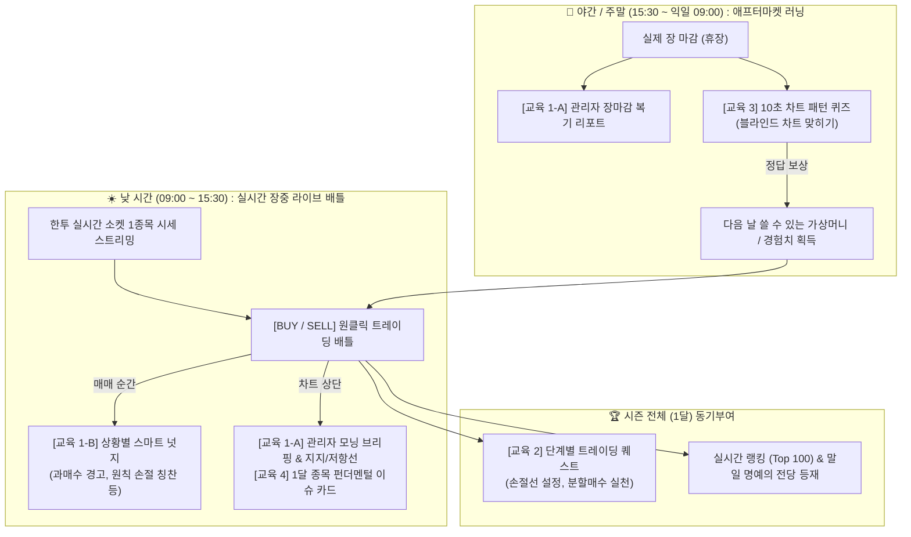
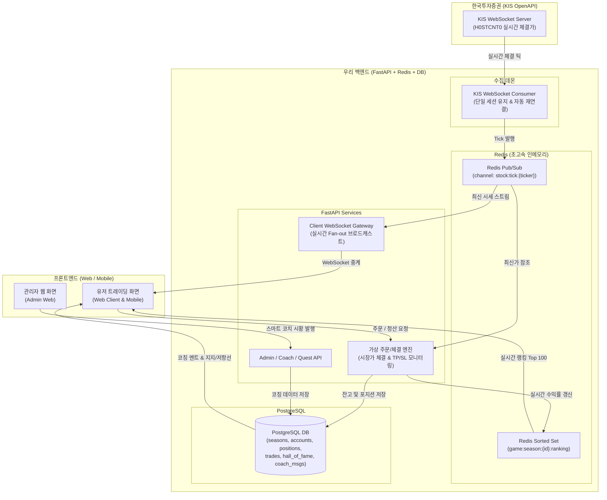

# 🎮 실시간 트레이딩 게임 (Trading Game) 종합 마스터 기획서

> **문서 상태:** 기획 및 아키텍처 확정 (Ready for Implementation)  
> **최종 수정일:** 2026-10-07  
> **대상 서비스:** Web Client (`/web_client`), Admin Web (`/admin_web`), Backend (`/backend`), Mobile (`/mobile`)

---

## 1. 프로젝트 배경 및 기획 방향

### 1.1 기획 의도
- 글로벌 인기 앱인 **'Trading Game: Stocks & Forex'**의 직관적이고 스릴 넘치는 게임 방식을 벤치마킹하여, 주식을 모르는 초보자도 1초 만에 이해하고 즐길 수 있는 가상 트레이딩 게임을 구축한다.
- 기존 증권사 HTS의 난해하고 지루한 진입장벽을 제거하고, **"게임 80% + 교육 20%"** 비율로 플레이하면서 저절로 실전 투자 원칙(리스크 관리, 캔들/이평선 분석, 기업 가치 이해)을 체득하는 **마이크로 러닝(Micro-Learning)**을 구현한다.

### 1.2 왜 일반 HTS 방식이 아닌 'Trading Game' 방식인가?

| 구분 | 일반 증권사 HTS / MTS | 우리가 구축하는 Trading Game | 채택 사유 |
| :--- | :--- | :--- | :--- |
| **체결 방식** | **호가창 대기 (지정가/시장가 매칭)**<br>호가 잔량이 소진되어야 체결 | **원클릭 즉시 체결 (No Waiting)**<br>한투 최신 틱 가격으로 딜레이 없이 즉시 포지션 오픈 | 대기 없는 빠른 속도감과 높은 게임성 제공 |
| **방향성** | **현물 매수(Long Only)** 중심<br>(개인 공매도 제한적) | **Long(상승) / Short(하락) 양방향**<br>하락장에서도 숏 베팅 가능 | 하락장에서도 랭킹 역전 및 배틀 가능 |
| **레버리지** | 신용융자 등 복잡한 조건 필요 | **x1, x2, x5 배율 선택** | 작은 시세 변동에도 짜릿한 손익 변동성 제공 |
| **인터페이스** | 복잡한 호가창, 수량/가격 다이얼로그 | 캔들 차트 하단 **큰 [BUY 📈] / [SELL 📉] 버튼 2개** | 모바일/웹 어디서나 원터치 플레이 |
| **포지션 피드백** | 잔고 평가 화면 별도 조회 | 포지션 카드에 **실시간 손익(+15.4%, +₩150,000) 카운팅** | 즉각적인 도파민과 시각적 몰입도 극대화 |

---

## 2. 핵심 게임 규칙 & 시즌제 운영 정책

### 2.1 시즌제 운영 (1달 주기)
1. **시즌 운영 주기**: 매월 1일 09:00 시작 ~ 매월 말일 15:30 정규장 마감 시 종료 (1개월 시즌).
2. **1개 종목 고정 배틀 (Fair Play)**:
   - 유저가 종목을 개별 선택하는 것이 아니라, 시스템이 **시즌 대표 종목 1개**를 지정 (예: 삼성전자, SK하이닉스, KODEX 레버리지 등 유동성이 풍부한 대형주).
   - 모든 유저가 완전히 동일한 차트와 시장 상황에서 승부하므로 운이 아닌 실력 기반의 공정한 경쟁 성립.
3. **가상 시드머니**: 시즌 시작 시 전 유저에게 동일하게 **10,000,000원** 지급.
4. **시즌 마감 및 초기화 (Reset)**:
   - 말일 15:30 장 마감 즉시 보유 중인 모든 포지션은 최종 체결가로 자동 시장가 청산.
   - 최종 수익률(ROI %) 확정 후 **최고 수익률 순으로 1위~100위를 [명예의 전당]에 영구 박제**.
   - 다음 달 1일이 되면 새 종목 발표와 함께 모든 유저의 자본금이 1,000만 원으로 전원 리셋.

### 2.2 주문 및 포지션 룰
- **포지션 방향**: 
  - `BUY (Long)`: 주가 상승 시 수익
  - `SELL (Short)`: 주가 하락 시 수익
- **투자 비중 조절**: 25% / 50% / 100%(전액) 원터치 칩 버튼.
- **배율 (Multiplier)**: 1x (현물), 2x, 5x 중 선택.
- **자동 익절/손절 (Take Profit / Stop Loss)**:
  - 포지션 진입 시 슬라이더로 TP(+5%, +10%) 및 SL(-2%, -5%)을 설정 가능. 시세 도달 시 자동 청산.
- **수수료 및 세금**: 가상 편도 수수료 0.015% 반영.

---

## 3. 24시간 에듀테인먼트 시스템 (4대 교육 모듈)

장이 열리는 낮 시간과 장이 닫히는 밤/주말 시간대를 분리하여 24시간 끊김 없는 재미와 교육을 제공한다.



### 3.1 투 트랙(2-Track) 스마트 코치 시스템
1. **Track 1: 관리자 데일리 시황 코치 (Admin-Managed Daily)**
   - **모닝 브리핑 (장전 08:30 등록)**:
     - 오늘 시황 전망, 예상 시나리오, 오늘의 추천 지지선/저항선 입력.
     - 지지선/저항선은 **유저 차트에 보라색/주황색 점선으로 자동 오버레이**되어 차트 분석 실전 감각을 길러줌.
   - **이브닝 마감 복기 (장후 15:40 등록)**:
     - 오늘 주가 변동 원인(외인/기관 수급, 뉴스) 분석.
     - 오늘 랭킹 상위 트레이더들의 매매 타이밍(진입/청산) 복기 해설.
2. **Track 2: 인-게임 실시간 액션 코치 (Rule-based Real-time)**
   - 매매 순간 1~2초간 토스트/말풍선 피드백:
     - RSI 80 이상 과매수 구간 추격매수 시: ⚠️ *"과열 구간입니다! 추격 매수는 위험해요."*
     - -2% 이내 손절 청산 시: 💡 *"원칙대로 손실을 잘 끊어냈습니다! 훌륭한 자금 관리입니다."*
     - 자본금 100% 몰빵 시: 💬 *"몰빵 대신 분할 매수로 리스크를 관리해 보세요."*

### 3.2 단계별 트레이딩 퀘스트 (Duolingo Style)
- **Quest 1:** 첫 Stop-Loss(손절선) 걸고 거래해보기 $\rightarrow$ 보상: + 가상머니 50만 원
- **Quest 2:** 이동평균선 골든크로스 발생 시 매수하기 $\rightarrow$ 보상: + 가상머니 100만 원
- **Quest 3:** 1회 거래 시 자본금 20% 이하로 3회 분할 매수하기 $\rightarrow$ 보상: '원칙주의자' 배지
- **Quest 4:** 손익비 2:1 이상으로 익절하기 $\rightarrow$ 보상: + 랭킹 보너스 점수

### 3.3 야간/주말 차트 퀴즈 (Pattern Hunter)
- 장이 끝난 야간/주말 유저 이탈을 방어하는 핵심 킬러 기능.
- 실제 과거 차트의 뒷부분을 가려놓고 10초 내에 **[오를까? 📈] [내릴까? 📉]** 선택.
- 정답 공개 시 망치형 캔들, 이중바닥, 헤드앤숄더 등 패턴 해설 제공 및 가상 시드머니 지급.

### 3.4 1달 종목 기업 이슈 카드
- 차트 상단에 배치되는 3줄 카드:
  - 📊 핵심 밸류: PER 12배, PBR 1.1배 (업종 평균 대비 저평가)
  - 📰 수급/뉴스: "외국인 4일 연속 순매수", "D램 가격 반등 호재"

---

## 4. UI / UX 화면 와이어프레임

### 4.1 유저 플레이 화면 (Web Client / Mobile)
```
┌─────────────────────────────────────────────────────────────┐
│ [시즌 1기] 삼성전자 (005930) | 종료 D-18     내 순위: 24위 / +24.5%│
│ 자본금: ₩12,450,000                      [🏆 랭킹] [🎯 퀘스트]│
├─────────────────────────────────────────────────────────────┤
│ 🌅 [오늘의 코치 가이드] "71,000원 지지선 반등 여부를 주목하세요!" (▼)│
├─────────────────────────────────────────────────────────────┤
│                                                             │
│  73,500 ------------------------------------ [추천 저항선]  │
│                   ▲  캔들 차트 (실시간 틱 반영)              │
│  71,000 - - - - - - - - - - - - - - - - - - [추천 지지선]  │
│                                                             │
│  💬 [코칭 팝업]: "RSI 78 돌파! 추격 매수는 물릴 위험이 높아요"│
├─────────────────────────────────────────────────────────────┤
│ [내 포지션] 삼성전자 LONG x2배  |  평가손익: +₩180,000 (+14.4%) │
│ 진입가: 71,200원 (현재가 72,100원)      [즉시 전액 청산하기]  │
├─────────────────────────────────────────────────────────────┤
│ 비중: [ 25% ]  [ 50% ]  [ 100% ]       배율: [ 1x ]  [ 2x ]  [ 5x ] │
│    [ 📈 BUY (상승 베팅) ]          [ 📉 SELL (하락 베팅) ]    │
└─────────────────────────────────────────────────────────────┘
 * 15:30 이후: 차트 영역이 [🧩 야간 10초 차트 퀴즈 도전!] 모드로 전환
```

### 4.2 관리자 웹 화면 (`admin_web` - 스마트 코치 관리)
```
[관리자 웹 > 트레이딩 게임 > 데일리 스마트 코치 발행]
───────────────────────────────────────────────────────────────
• 시즌 선택 : [ 시즌 1기 - 삼성전자 (005930) ▼ ]
• 발행 유형 : 🔘 장전 모닝 브리핑 (08:30)   ⚪ 장마감 이브닝 복기 (15:40)
• 적용 일자 : 2026-10-07
• 차트 상단 1줄 롤링 멘트 :
  [ 미국 반도체 지수 +3% 급등! 시초가 갭상승 후 71,000원 지지 확인 권장 ]
• 오늘의 핵심 가격 라인 (차트 위 자동 점선 오버레이) :
  - 추천 지지선: [ 71,000 ] 원
  - 추천 저항선: [ 73,500 ] 원
• 상세 시황 코칭 본문 (Markdown 에디터) :
  [ 오늘 새벽 엔비디아 실적 기대감으로 필라델피아 반도체 지수가 강세를 보였습니다... ]
───────────────────────────────────────────────────────────────
[  임시저장  ]    [ 🚀 유저 화면에 실시간 발행하기 ]
```

---

## 5. 시스템 아키텍처 및 데이터 흐름



---

## 6. 데이터베이스 테이블 설계 (PostgreSQL)

### 6.1 `game_seasons` (시즌 마스터)
| 컬럼명 | 타입 | 설명 |
| :--- | :--- | :--- |
| `id` | Serial (PK) | 시즌 식별자 |
| `season_number` | Integer | 시즌 기수 (예: 1, 2, ...) |
| `ticker` | Varchar(20) | 시즌 고정 종목 코드 (예: '005930') |
| `stock_name` | Varchar(50) | 종목명 (예: '삼성전자') |
| `start_at` | Timestamp | 시즌 시작일시 (매월 1일 09:00) |
| `end_at` | Timestamp | 시즌 종료일시 (매월 말일 15:30) |
| `initial_cash` | BigInt | 시작 자본금 (기본: 10,000,000) |
| `status` | Varchar(20) | 'READY', 'ACTIVE', 'FINISHED' |

### 6.2 `game_accounts` (유저 시즌별 가상 계좌)
| 컬럼명 | 타입 | 설명 |
| :--- | :--- | :--- |
| `id` | UUID (PK) | 계좌 ID |
| `user_id` | UUID (FK) | 유저 식별자 |
| `season_id` | Integer (FK) | 참가 시즌 ID |
| `cash_balance` | Numeric(15,2) | 보유 현금(예수금) |
| `total_asset` | Numeric(15,2) | 예수금 + 포지션 평가자산 |
| `current_roi` | Numeric(8,4) | 현재 수익률 (%) |
| `max_roi` | Numeric(8,4) | 시즌 중 기록한 최고 수익률 (%) |
| `total_trades` | Integer | 총 거래 횟수 |
| `win_trades` | Integer | 익절 성공 횟수 |

### 6.3 `game_positions` (활성 포지션)
| 컬럼명 | 타입 | 설명 |
| :--- | :--- | :--- |
| `id` | UUID (PK) | 포지션 ID |
| `account_id` | UUID (FK) | 계좌 ID |
| `side` | Varchar(10) | 'LONG' (상승) / 'SHORT' (하락) |
| `entry_price` | Numeric(12,2) | 진입 체결단가 |
| `size_amount` | Numeric(15,2) | 투자 원금 |
| `leverage` | Integer | 레버리지 배율 (1, 2, 5) |
| `stop_loss_price` | Numeric(12,2) | 손절 기준가 (선택) |
| `take_profit_price` | Numeric(12,2) | 익절 기준가 (선택) |
| `status` | Varchar(20) | 'OPEN', 'CLOSED' |
| `created_at` | Timestamp | 진입 일시 |

### 6.4 `game_trades` (청산 완료 내역)
| 컬럼명 | 타입 | 설명 |
| :--- | :--- | :--- |
| `id` | UUID (PK) | 거래 ID |
| `account_id` | UUID (FK) | 계좌 ID |
| `side` | Varchar(10) | 'LONG' / 'SHORT' |
| `entry_price` | Numeric(12,2) | 진입가 |
| `exit_price` | Numeric(12,2) | 청산가 |
| `pnl_amount` | Numeric(15,2) | 실현 손익금 |
| `roi_pct` | Numeric(8,4) | 실현 수익률 (%) |
| `closed_reason` | Varchar(20) | 'MANUAL', 'TAKE_PROFIT', 'STOP_LOSS', 'SEASON_END' |
| `closed_at` | Timestamp | 청산 일시 |

### 6.5 `hall_of_fame` (명예의 전당 아카이브)
| 컬럼명 | 타입 | 설명 |
| :--- | :--- | :--- |
| `id` | Serial (PK) | 기록 ID |
| `season_id` | Integer (FK) | 시즌 ID |
| `rank` | Integer | 최종 순위 (1~100) |
| `user_id` | UUID (FK) | 유저 ID |
| `user_nickname` | Varchar(50) | 닉네임 |
| `final_roi` | Numeric(8,4) | 최종 수익률 (%) |
| `final_asset` | Numeric(15,2) | 최종 총자산 |
| `win_rate` | Numeric(5,2) | 승률 (%) |

### 6.6 `game_coach_messages` (관리자 스마트 코치 브리핑)
| 컬럼명 | 타입 | 설명 |
| :--- | :--- | :--- |
| `id` | Serial (PK) | 메시지 ID |
| `season_id` | Integer (FK) | 시즌 ID |
| `target_date` | Date | 코칭 적용 날짜 |
| `coach_type` | Varchar(20) | 'MORNING', 'EVENING', 'IN_PLAY' |
| `title` | Varchar(100) | 브리핑 제목 |
| `summary_nudge` | Varchar(200) | 차트 상단 1줄 롤링 텍스트 |
| `content_md` | Text | 상세 시황 및 전략 마크다운 본문 |
| `support_price` | Numeric(12,2) | 차트 위 추천 지지선 (Nullable) |
| `resistance_price`| Numeric(12,2) | 차트 위 추천 저항선 (Nullable) |
| `published_at` | Timestamp | 발행 일시 |
| `author_id` | UUID (FK) | 작성 관리자 ID |

### 6.7 `chart_quiz_pool` (야간 차트 패턴 퀴즈 풀)
| 컬럼명 | 타입 | 설명 |
| :--- | :--- | :--- |
| `id` | Serial (PK) | 퀴즈 ID |
| `ticker` | Varchar(20) | 퀴즈 대상 종목 코드 |
| `pattern_type` | Varchar(50) | 패턴 분류 (예: '망치형캔들', '이중바닥', '골든크로스') |
| `chart_snapshot` | JSON | 가려진 시점까지의 캔들 OHLCV 배열 |
| `answer` | Varchar(10) | 정답 ('UP', 'DOWN') |
| `actual_change` | Numeric(6,2) | 이후 실제 변동률 (%) |
| `explanation` | Text | 패턴 기술적 분석 교육 해설 |
| `reward_cash` | Integer | 맞췄을 때 지급하는 가상머니 (예: 200,000원) |

---

## 7. 단계별 개발 로드맵 (Milestones)

```
[Phase 1: 기획 확정 및 DB 스키마 마이그레이션]
  ├── 게임 테이블 모델링 (SQLAlchemy) & 마이그레이션 (Alembic)
  └── 기초 데이터 시딩 (시즌 1기 생성, 차트 퀴즈 20문항)

[Phase 2: 한투 실시간 WebSocket 시세 수집기 구축]
  ├── KIS 실시간 WebSocket Client (H0STCNT0 TR 연동)
  ├── 수집 데몬 프로세스 & 자동 재연결 로직 구현
  └── Redis Pub/Sub 채널 발행 검증

[Phase 3: 가상 체결 엔진 및 클라이언트 중계 WS Gateway]
  ├── FastAPI WebSocket Gateway (클라이언트 시세 중계)
  ├── 원클릭 가상 주문/체결 (BUY/SELL) 및 자동 TP/SL 감시 엔진
  └── 실시간 PnL 계산 및 마진콜(강제청산) 처리

[Phase 4: 실시간 랭킹 & 시즌 정산 시스템]
  ├── Redis ZSET 기반 실시간 랭킹 (Top 100) 정산 API
  └── 시즌 마감 스케줄러 (Celery Beat) & 명예의 전당 적재

[Phase 5: 교육 & 스마트 코치 모듈 + 관리자 웹(admin_web)]
  ├── [admin_web] 관리자 스마트 코치 작성/발행 페이지 개발
  ├── 인-게임 실시간 상황별 코칭(Nudge) 룰 엔진
  ├── 단계별 퀘스트 로직 및 보상 처리
  └── 야간 10초 차트 퀴즈 API

[Phase 6: 프론트엔드 UI 화면 구현 (web_client / mobile)]
  ├── 실시간 캔들 차트 & 원클릭 매수/매도 트레이딩 패널
  ├── 차트 위 관리자 지지선/저항선 오버레이 & 코칭 배너
  ├── 실시간 랭킹 & 명예의 전당 뷰
  └── 야간 퀴즈 모달 & 퀘스트 뷰
```
